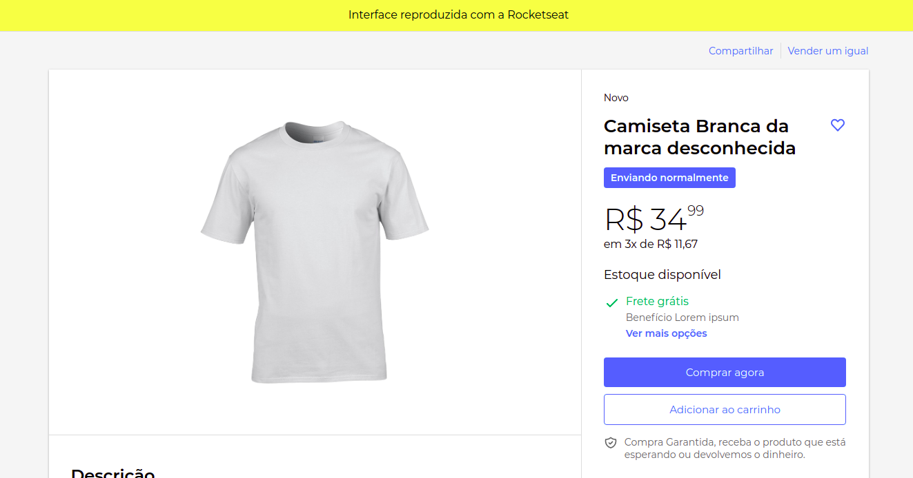

<p align="center">
  <a href="" rel="noopener">
 </a>
</p>

<h3 align="center">mercado-livre-ui-clone</h3>

---

## 📝 Table of Contents

- [Demo / Working](#demo)
- [Getting Started](#getting_started)

## 🎥 Demo / Working <a name = "demo"></a>

<p>To view the application
  <a href="#">
    click here
  </a>
<p>

</a>

## 🏁 Getting Started <a name = "getting_started"></a>

### Prerequisites

What things you need to install the software and how to install them.

- node.js
- npm

### Installing

Go into the project folder and run

```
  npm install || yarn
```

right after it installs all the packages you can run the command

```
  npm start
```

This will make the project start running in [http://localhost:3000/](http://localhost:3000)

### Reference

- [Página de produto do Mercado Livre com ReactJS | UI Clone #12](https://www.youtube.com/watch?v=APs_xQ2hUOE&t=1506s)
